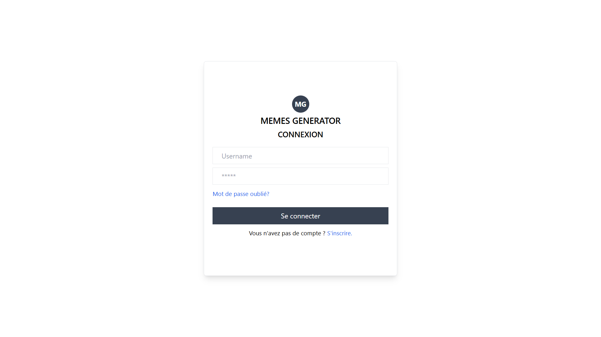
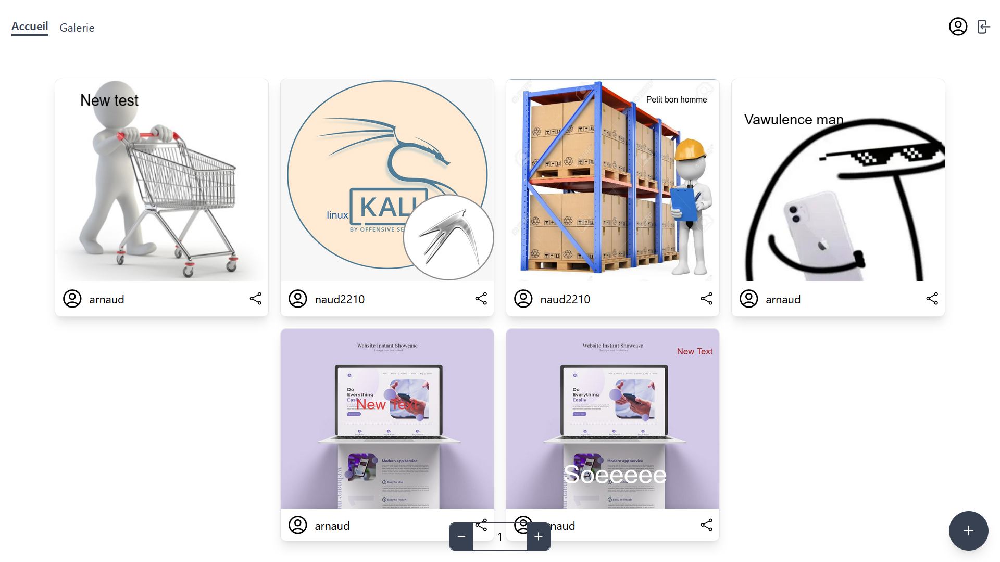
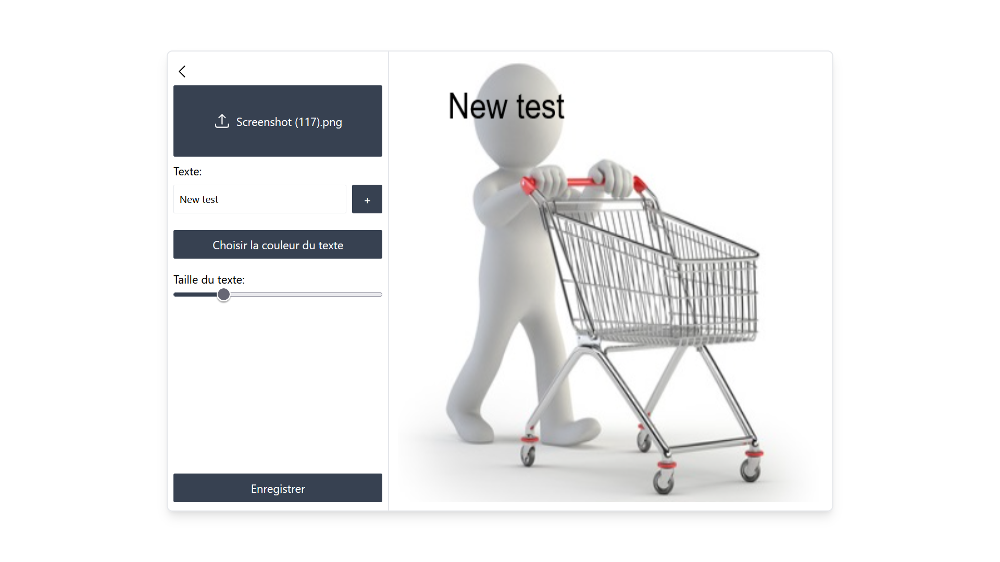
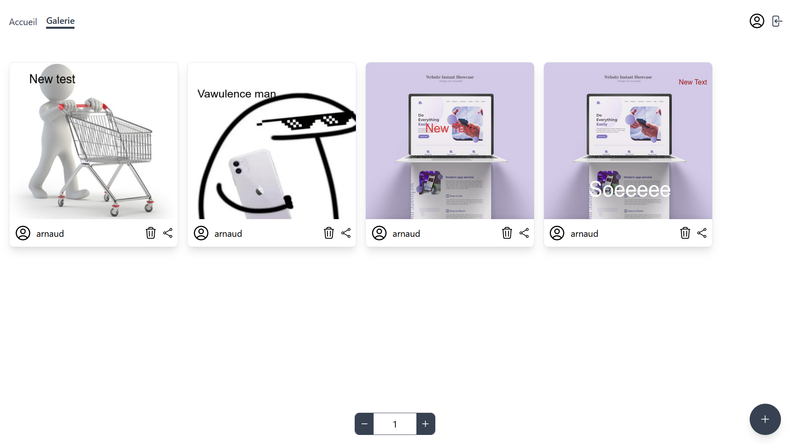
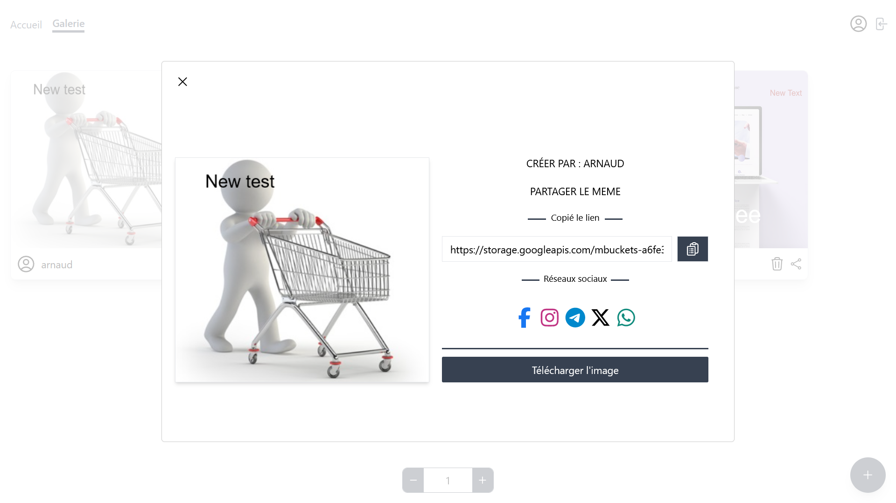

# MEMEGEN

## Description
Ce projet consiste à générer des mèmes en ligne. Les utilisateurs peuvent télécharger des images, ajouter du texte, et créer rapidement des mèmes. Il permet également de visualiser, télécharger et partager les mèmes créés.

## Etapes
Pour démarrer ce projet, voici les étapes à suivre:

1. Démarrage du serveur web backend (api)

*Création d'un environnement virtuel

Déplacez vous dans le répertoire api:

```bash
cd api
```

Entrez la commande suivante en nommant votre environnement:

```bash
python -m venv nom_environnement
```

*Activation de l'environnement

Déplacer vous dans le dossier nouvellement créé et nommé par le nom défini plus haut:

** Sous Windows

```bash
cd nom_environnement\Scripts
```

```bash
activate
```

** Sous Linux

```bash
source nom_environnement/bin/activate
```

*Installation des dépendances (se positionner dans le répertoire api)

** Sous Windows

```bash
pip install -r requirements.txt
```

** Sous Linux

```bash
pip install -r requirements.txt
```

*Démarrer le serveur

En local:

```bash
fastapi dev main.py
```

Connectez vous sur ce lien: [text](http://127.0.0.1:8000/docs)

En production:

```bash
fastapi run
```

NB: Positionnez vous dans le répertoire api avant de passer à l'installation et le démarrage du serveur

2- Démarrer le serveur frontend (web interface)

*Installation des dépendances

Déplacez vous dans le répertoire frontend:

```bash
cd frontend
```

Entrez la commande suivante:

Déplacez vous dans le répertoire api:

```bash
npm install
```

*Démarrer le serveur

Lancer le serveur web avec:

Déplacez vous dans le répertoire api:

```bash
npm run dev
```

Connectez vous sur ce lien: [text](http://localhost:5173/)

## Quelques captures

Page d'authentification



Page d'accueil



Page de création



Galerie



Partage de mèmes

